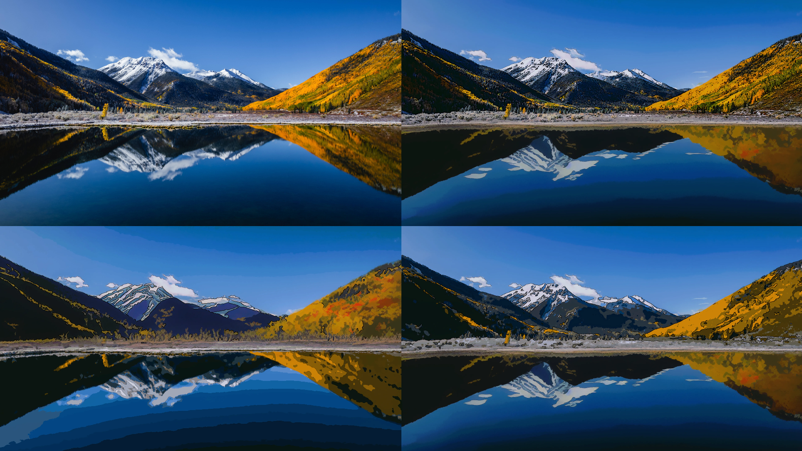
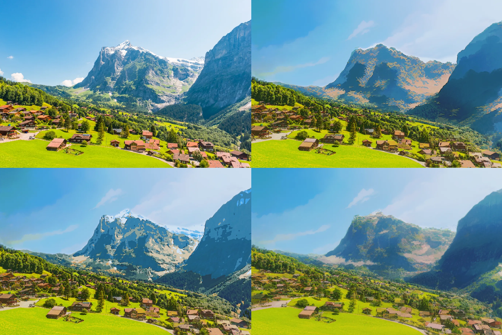
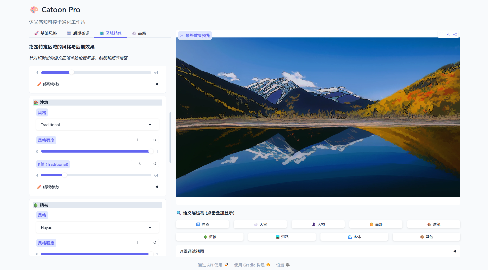

# 🎨 Catoon: 语义感知可控卡通化框架

<div align="center">

[](https://www.python.org/)
[](https://pytorch.org/)
[](https://gradio.app/)
[](LICENSE)
[]()
[]()

**Training-free 的语义感知图像风格化系统**  
消除多风格融合中的"缝合怪"现象与"边缘伪影"，实现语义区域级可控的艺术创作。

[快速开始](#-快速开始) • [核心特性](#-核心特性) • [系统架构](#-系统架构) • [开发文档](docs/ARCHITECTURE.md)

</div>

## 📖 项目简介

**Catoon** 是一个无需训练（Training-free）的图像卡通化框架。与传统的全图风格迁移不同，Catoon 引入了**语义感知（Semantic Awareness）**机制，能够智能识别图像中的天空、人物、建筑、植被等区域，并允许用户为每个区域指定不同的艺术风格（如 Traditional, AnimeGAN, Diffusion）。

为了解决多风格拼接带来的视觉不一致问题，本项目提出了**区域级拉普拉斯金字塔融合**与**全局直方图匹配协调**算法，有效消除了接缝伪影（Halo artifacts）和色调割裂感。

## 🖼️ 效果演示

这里展示了 **Catoon** 的核心能力：对原图进行语义分割，并对不同区域应用差异化的卡通风格。(左上角为原图，其余图片是不同组合的微调风格化效果)



## ✨ 核心特性

### 🗺️ 语义级精确控制

基于 **SegFormer** 的高精度语义分割，自动识别 150+ 种物体并归类为 7 大语义桶（天空、植被、建筑等），实现精细的分区风格化。

### 🎭 多模态风格路由

支持多种风格化引擎的混合调度：

- **Traditional**: 基于双边滤波与 KMeans 的传统算法（速度快，色块感强）
- **AnimeGAN**: 基于 GAN 的特定风格迁移（宫崎骏、新海诚、今敏风格）
- **Diffusion**: 基于 ControlNet + Stable Diffusion 的生成式风格化（高细节，强构图）

### 🔗 无缝区域融合

摒弃简单的像素叠加，采用 **Laplacian Pyramid Fusion（拉普拉斯金字塔融合）** 和 **Soft Masking** 技术，确保不同风格区域的过渡自然，无明显边缘锯齿。

### 🎨 全局色彩协调

内置 **Harmonizer** 模块，通过参考区域（如天空）的直方图匹配，自动调整全图色调，避免"缝合怪"现象。

### 👤 智能人脸保护

集成 **MediaPipe** 人脸检测，提供多种保护策略（强制保留、风格混合），防止人物面部在风格化过程中崩坏。

### ✏️ 艺术线稿增强

双引擎线稿生成：**Canny**（高保真）与 **XDoG**（艺术感），支持 Guided Filter 细节注入。

## 🖥️ 界面预览

本项目提供基于 Gradio 的可视化交互界面，支持实时调节参数、查看语义掩码。



## 🏗️ 系统架构


详细设计文档请参阅 [ARCHITECTURE.md](docs/ARCHITECTURE.md)。

## 🚀 快速开始

### 1. 环境准备

建议使用 Conda 管理环境（推荐 Python 3.10 + CUDA 12.1）：

```bash
git clone https://github.com/yourusername/Catoon.git
cd Catoon

conda create -n catoon python=3.10 -y
conda activate catoon

# 安装 PyTorch
pip install torch torchvision --index-url https://download.pytorch.org/whl/cu121

# 安装核心依赖
pip install -r requirements.txt
```

### 2. 启动 Web UI

本项目提供基于 Gradio 的交互式界面：

```bash
python ui/gradio_app.py
```

启动后访问：http://localhost:7860

---

## 📂 目录结构

```
Catoon/
├── config/             # YAML 配置文件
├── docs/               # 设计与技术文档
│   ├── ARCHITECTURE.md # 完整架构设计
│   ├── dependencies.md # 依赖与安装
│   └── PROGRESS.md     # 开发进度
├── src/                # 核心源码
│   ├── fusion/         # 融合算法 (SoftMask, Pyramid)
│   ├── harmonization/  # 色彩协调
│   ├── lineart/        # 线稿引擎 (Canny, XDoG, GuidedFilter)
│   ├── pipeline.py     # 主流水线
│   ├── routing/        # 语义路由策略
│   ├── segmentation/   # 分割模型 (SegFormer)
│   └── stylizers/      # 风格化器 (GAN, Diffusion, Traditional)
├── ui/                 # Gradio 界面模块
│   ├── gradio_app.py   # 入口点
│   ├── state.py        # 会话状态管理
│   ├── config.py       # 参数数据类
│   ├── components.py   # UI 组件工厂
│   ├── theme.py        # CSS 和主题
│   ├── layout.py       # 主布局
│   └── logic.py        # 业务逻辑
├── tests/              # 测试套件 (141 tests)
├── weights/            # 模型权重目录
└── requirements.txt
```

## 🗓️ 开发路线图

- [x] **Phase 1: 基础框架 (MVP)**

  - SegFormer 语义分割集成
  - 传统算法风格化与基础融合

- [x] **Phase 2: 核心增强**

  - AnimeGAN 多风格集成
  - Laplacian Pyramid 高级融合算法
  - 人脸保护策略

- [x] **Phase 3: 生成式扩展**

  - 引入 Stable Diffusion + ControlNet
  - XDoG 艺术线稿与细节注入
  - UI 模块化重构

- [ ] **Phase 4: 性能优化 (TODO)**
  - int8 量化推理
  - 实时视频流处理支持

## 🔧 配置

主要配置项 (`config/default.yaml`):

```yaml
global:
  max_image_size: 1024
  device: "auto"

segmentation:
  model: "segformer"
  backbone: "mit-b2"

fusion:
  default_method: "soft_mask"

harmonization:
  enabled: true
  reference_region: "SKY"

lineart:
  engine: "canny"
  default_strength: 0.5
```

---

## 📖 文档

| 文档                                    | 描述                   |
| --------------------------------------- | ---------------------- |
| [ARCHITECTURE.md](docs/ARCHITECTURE.md) | 完整架构设计与模块规格 |
| [dependencies.md](docs/dependencies.md) | 依赖与安装指南         |

---

## 🤝 致谢

本项目参考或使用了以下优秀的开源项目：

- [SegFormer](https://github.com/NVlabs/SegFormer) - 语义分割
- [AnimeGANv2](https://github.com/TachibanaYoshino/AnimeGAN) - 风格迁移
- [ControlNet](https://github.com/lllyasviel/ControlNet) - 结构控制
- [Stable Diffusion](https://github.com/CompVis/stable-diffusion) - 扩散模型
- [MediaPipe](https://mediapipe.dev/) - 人脸检测
- [Gradio](https://gradio.app/) - 界面框架

---

## 📄 License

MIT License
